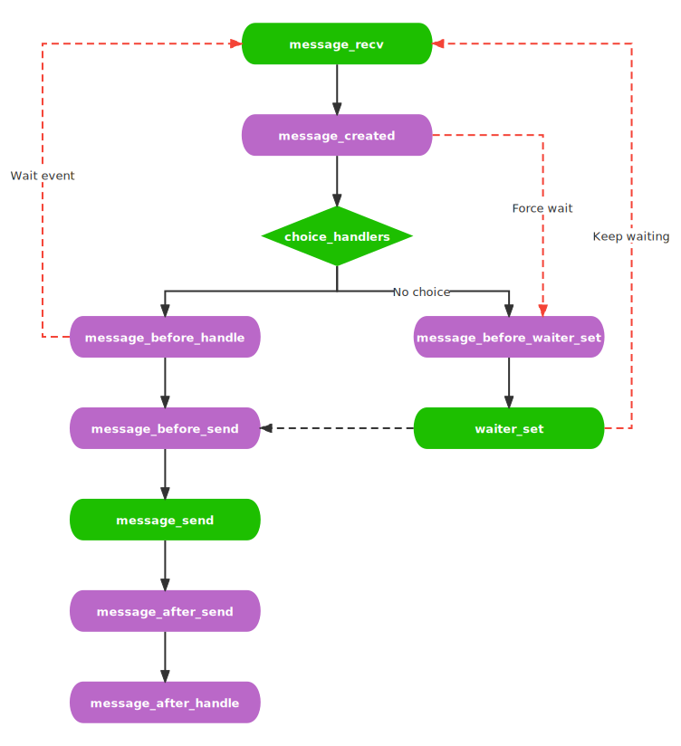

# 生命周期

AmiyaBot 接收的消息和事件，都会历经一个完整的生命周期。你可以介入这些周期来对业务进行进一步的调整。

## 消息生命周期

在接收消息到回复发送完毕，总共会经过至少五个周期，如下图所示，紫色的节点就是可以介入的周期。

如果消息响应里存在等待事件，那么周期将会延长，再次从消息接收开始，直至等待事件结束后继续向下执行。



通过 AmiyaBot 对象或 PluginInstance 对象注册周期钩子函数。

> 所有钩子均可以同时存在多个，按加载顺序逐个调用。

### message_created

消息创建完毕阶段，可以在此阶段修改 Message 对象并返回。存在多个此钩子时，按加载顺序逐个调用，参数接受的 Message
对象受上一个函数的执行结果影响。

该钩子函数可返回三种结果：

- **None**：对后续不产生影响
- **Message**：修改 Message 对象，将影响后续所有周期进程的参数
- **False**：布尔值仅可返回 False，将结束生命周期（包括此周期后续的钩子函数）

```python
@bot.message_created
async def _(data: Message, instance: BotAdapterProtocol):
    if ...:
        data.text = ...
        return data
```

### message_before_waiter_set

当存在等待事件且消息分配器无返回或等待事件属于强制等待类型时，在进入等待事件前执行此钩子。

```python
from amiyabot import Waiter

@bot.message_before_waiter_set
async def _(data: Message, waiter: Waiter, instance: BotAdapterProtocol):
    ...
```

### message_before_handle

当消息分配器有返回，在执行消息响应器前执行此钩子。存在多个此钩子时，按加载顺序逐个调用。全部执行完成后当有其中一个返回
False，则不往下继续执行并结束生命周期。

```python
@bot.message_before_handle
async def _(data: Message, factory_name: str, instance: BotAdapterProtocol):
    if ...:
        return False
    return True
```

### message_before_send

当消息响应器执行完毕且存在返回时，在发送其返回前执行此钩子。可以在此阶段修改 Chain 对象并返回。存在多个此钩子时，按加载顺序逐个调用，参数接受的
Chain 对象受上一个函数的执行结果影响。

```python
@bot.message_before_send
async def _(chain: Chain, factory_name: str, instance: BotAdapterProtocol):
    ...
    return chain
```

### message_after_send

当消息响应器执行完毕且存在返回时，在发送其返回结束后执行此钩子。

```python
@bot.message_after_send
async def _(chain: Chain, factory_name: str, instance: BotAdapterProtocol):
    ...
```

### message_after_handle

当消息响应器执行完毕（无论有没有返回）后执行此钩子。

```python
@bot.message_after_handle
async def _(chain: Optional[Chain], factory_name: str, instance: BotAdapterProtocol):
    ...
```

## 事件生命周期

目前事件生命周期只有一个。

```python
@bot.event_created
async def _(event: EventType, instance: BotAdapterProtocol):
    ...
```
