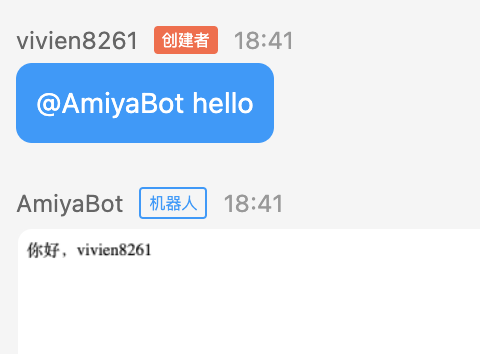

# 发送 html 生成的图片

发送一张使用 html 页面生成的图片，在同等工作量下，它通常比使用 PIL 合成的图片更加生动，技术难度也比 PIL 要低得多。

::: danger 操作系统支持<br>

HTML制图需要使用 playwright 模块，所以仅支持以下操作系统：

- Windows 10、Windows Subsystem for Linux (WSL) 或 Windows Server 2012 及以上系统
- MacOS 11 (Big Sur) 及以上系统
- Linux 系统官方支持 Debian 11、Ubuntu 18.04 以及 Ubuntu 20.04

:::

## 安装 Chromium

命令行执行以下命令安装 Chromium 内核：

```bash
# Windows or MacOS
playwright install chromium
# Linux
playwright install --with-deps chromium
```

## 启动时打开 Chromium

在 bot（包括[多账号实例](/develop/basic/multipleAccounts.html#创建一个多账号实例)）启动的 start
方法内设置参数 `launch_browser=True`

```python
bot.start(launch_browser=True)
```

进阶使用：[改变默认的 Playwright 启动行为](/develop/advanced/playwright)

## Chain().html()

| 参数名         | 类型         | 释义           | 默认值  |
|-------------|------------|--------------|------|
| path        | String     | 模板文件路径或网站URL |      |
| data        | Dict, List | 传入模板文件的数据    |      |
| width       | int        | 浏览器视窗宽度      | 1280 |
| height      | int        | 浏览器视窗高度      | 720  |
| is_template | Bool       | 是否为模板文件      | True |
| render_time | Int        | 渲染时间（毫秒）     | 200  |

```python
Chain(data).html('template.html', {...})
```

## **创建html模板文件**

```html
<!-- index.html -->
<!doctype html>
<html lang="en">
<head>
    <meta charset="UTF-8">
    <meta name="viewport"
          content="width=device-width, user-scalable=no, initial-scale=1.0, maximum-scale=1.0, minimum-scale=1.0">
    <meta http-equiv="X-UA-Compatible" content="ie=edge">
    <title>template</title>
</head>
<body>
<div id="template">
    <div>你好，{{ data.username }}</div>
</div>
</body>
<!-- 引入 vue.js -->
<script src="https://cdn.jsdelivr.net/npm/vue@2"></script>
<script>
    const template = new Vue({
        el: '#template',
        methods: {
            init(data) {
                this.$set(this, 'data', data)
            }
        },
        data() {
            return {
                data: {}
            }
        },
        mounted() {
            // 暴露 init 方法供核心调用
            window.init = this.init
        }
    })
</script>
</html>
```

#### **Vue.js**

模板文件建议使用 [Vue.js](https://cn.vuejs.org/)（以下简称 `vue`）编写，vue 可以有效提高模板渲染速度以及代码可读性。

当然这里只是示例，你也可以使用自己惯用的方法。

将需要渲染的数据传入模板：

```python
@bot.on_message(keywords='hello')
async def _(data: Message):
    return Chain(data).html('hello.html', {'username': data.nickname})
```

示例在触发会话并开始发送消息时，Chain 对象将会调用 Chromium 无头浏览器，渲染 `hello.html` 并在页面内执行 JavaScript
语句 `init({'username': 'vivien8261'})`
。<br>
渲染结束后，无头浏览器截图生成图片，然后执行常规的图片发送方法。



_效果用于示例，相信你可以写出更为美观的页面。_

::: tip 小建议 <br>
html 制图的目的旨在不使用 PIL 也能制作出美观的图片，但不建议你滥用。在仅渲染文字和少量图案时，PIL 的效率会比 html 高得多。
:::

## **通过网站URL制图**

支持直接使用网站URL生成图片。

::: danger 注意 <br>
在页面加载完毕后，默认预留200ms的渲染时间。如果页面有部分元素是异步渲染的，将有可能不显示在图片内。可通过参数 `render_time`
设置需要的时间。
:::

设置参数 `is_template=False`

```python
@bot.on_message(keywords='hello')
async def _(data: Message):
    return Chain(data).html('https://www.baidu.com/',
                            is_template=False,
                            render_time=1000)
```

触发会话时，渲染 `https://www.baidu.com/` 页面，并在等待 `1000ms` 后截图发送图片。
