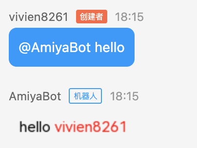

# 文字生成的图片

此方法可以将文字转换为图片发送，使用**调色模板**可以进行文字调色，亦可插入图片渲染。

## Chain().text_image()

| 参数名     | 类型              | 释义    | 默认值     |
|---------|-----------------|-------|---------|
| text    | str             | 内容文本  |         |
| images  | List[ImageElem] | 插入图片  | None    |
| width   | int             | 图片宽度  | None    |
| height  | int             | 图片高度  | None    |
| bgcolor | str             | 图片背景色 | #F5F5F5 |

```python
Chain(data).text_image('hello, world')
```

### 调色模板

在文本内使用
<span style="color: red">\[cl </span>
<span style="color: #001eff">文字内容</span>@<span style="color: #009331">#颜色代码</span>
<span style="color: red"> cle]</span>
格式的模板，将指定文字内容改变颜色。

```python
@bot.on_message(keywords='hello')
async def _(data: Message):
    return Chain(data).text(f'hello [cl {data.nickname}@#ff0000 cle]')
```



::: danger text_image 无法插入表情<br>
如果 `Chain.text` 的文本内使用了**调色模板**，将会强制转换为图片。同时 `[face:ID]` 模板也会失效。
:::

### 渲染图片

在 images 参数内传入一个包含 ImageElem 对象的列表，可在文字图片内渲染图片。<br>

**ImageElem**

| 参数名  | 类型         | 释义            | 默认值 |
|------|------------|---------------|-----|
| path | str        | 图片路径          |     |
| size | int        | 图片大小          |     |
| pos  | (int, int) | 图片渲染位置 (x, y) |     |

简单尝试一下，发送一张 `hello, world` 的文字图片，并在里面插入一张图片。<br>
需要注意的是，因为 `hello, world` 文字只有一行，所以需要指定一下**图片高度**。否则插入的图片可能会显示不全。<br>
你可以一次插入很多张图片，所以任何时候，都请把握好你的**文字图片宽高**与插入的图片的**大小、坐标**之间的影响。

```python
from amiyabot.builtin.lib.imageCreator import ImageElem


@bot.on_message(keywords='hello')
async def _(data: Message):
    image = ImageElem(path='face.png', size=80, pos=(0, 20))

    return Chain(data).text_image('hello，world', images=[image], height=100)
```

你可以收到如下的回复


## 更换字体

可以使用自己的 ttf 字体文件更换字体

```python
from amiyabot.builtin.lib.imageCreator import FontStyle

FontStyle.file = './font.ttf'
```
