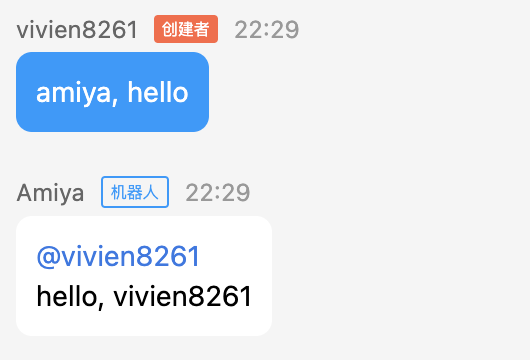
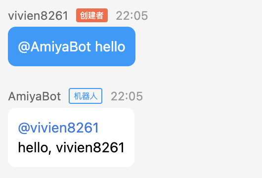

# 起步

在开始之前，我们希望你知道 AmiyaBot 是一款针对 QQ
频道机器人的框架。如果你想使用第三方机器人服务（如 [mirai-api-http](https://github.com/project-mirai/mirai-api-http)），可更改实例的适配器。<br>
接下来的文档将围绕 QQ 频道机器人展开。**如果需要 [更改适配器](/develop/basic/selectAdapter) 可直接阅读下一节**。

我们建议你先在 [QQ开放平台](https://q.qq.com/) 了解 QQ 频道机器人的运营规则，这非常重要，因为在本文档里，关于这部分的内容将会非常少。如果你并不了解 QQ 频道机器人，后续的文档可能会对你造成疑惑。

## 安装依赖

```bash
pip install amiyabot
```

## 创建你的第一个 Bot

1. 在 [QQ开放平台](https://q.qq.com/) 申请并创建你的 QQ 机器人。创建沙箱频道，并把你的机器人添加进频道里。（此处不作详细说明）
2. 使用机器人的 `appid` 和 `token` 创建一个 AmiyaBot 实例

```python
import asyncio

from amiyabot import AmiyaBot, Message, Chain

bot = AmiyaBot(appid='******', token='******')


@bot.on_message(keywords='hello')
async def _(data: Message):
    return Chain(data).text(f'hello, {data.nickname}')


asyncio.run(bot.start())
```

3. 运行代码，在频道里输入 `@机器人 hello`，你预期会看到如下输出。



那么恭喜你，你的 QQ 机器人已经可以正常运作了。

> _「这是个人迈出的一小步，但却是人类迈出的一大步。」—— 阿姆斯特朗_

## 创建私域机器人

如果你在平台创建的是**私域机器人**，在 `AmiyaBot` 的参数里设置 `private=True` 来开启私域模式，私域机器人支持接收非 `@机器人` 的消息，你可以使机器人以更灵活的方式触发功能。<br>
但我们不希望机器人的唤起出现非预期的效果，所以 AmiyaBot 私域模式默认需要添加前缀触发词。

```python
# 配置 private=True 让实例改为私域
bot = AmiyaBot(appid='******', token='******', private=True)

# 添加前缀触发词
bot.prefix_keywords = ['amiya', 'amy']
```

使用前缀触发词唤醒机器人


