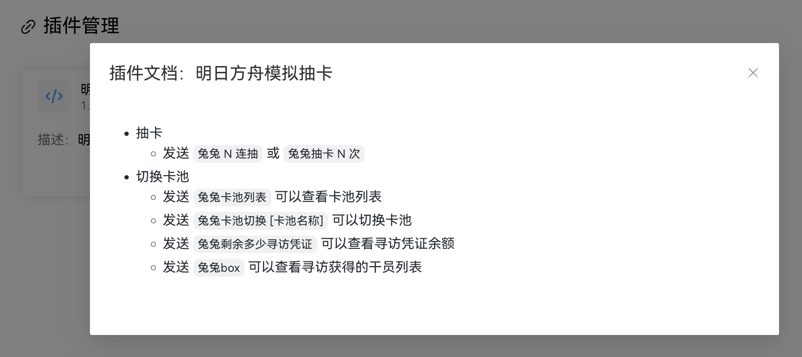

# 对接控制台

你可以通过**对接控制台**使用户能够使用控制台的界面管理你的插件。如下所示。



## AmiyaBotPluginInstance

对接控制台需要在创建插件实例类时使用或继承 [AmiyaBot-demo](/guide/deploy/) 项目中的 **AmiyaBotPluginInstance** 类而不是上文的
PluginInstance

在 demo 项目里导入 `AmiyaBotPluginInstance`

```python
from core.customPluginInstance import AmiyaBotPluginInstance

bot = AmiyaBotPluginInstance(
    name='我的插件',
    version='1.0',
    plugin_id='my-plugin',
    description='我的第一个插件',
    channel_config_default=...,
    channel_config_schema=...,
    global_config_default=...,
    global_config_schema=...,
    deprecated_config_delete_days=...,
)
```

AmiyaBotPluginInstance 继承了 PluginInstance，并且拥有以下新参数和方法

### 参数

| 参数名                           | 类型  | 释义                   | 默认值  |
|-------------------------------|-----|----------------------|------|
| channel_config_default        | str | 频道级别配置默认值            | None |
| channel_config_schema         | str | 频道级别配置表单的 JsonSchema | None |
| global_config_default         | str | 全局级别配置默认值            | None |
| global_config_schema          | str | 全局级别配置表单的 JsonSchema | None |
| deprecated_config_delete_days | int | 旧配置项失效的天数            | 7    |

- 默认值和 JsonSchema 传入的值均为字符串，可以是 JSON 字符串或 `json` 文件路径。（默认值允许使用 `yaml` 文件路径）
- 在控制台中点击 `重置为默认` 时会使用默认值的 JSON 数据覆盖，创建新配置项时使用默认值的 JSON 数据填充。
- 如果提供了 JsonSchema，将会使用 JsonSchema 创建表单界面，否则使用默认值的 JSON 数据。
- 如果提供了 JsonSchema，必须同时提供默认值数据。

```python
bot = AmiyaBotPluginInstance(
    channel_config_default='./config.yaml',
    channel_config_schema='./jsonSchema.json'
)
```

### 方法

**get_config**

读取一个指定名称的配置项，如果没有频道级别的配置则返回同名全局配置，如果也没有全局配置，返回 `None`。传入 `channel_id=None`
可以直接读取全局配置。

| 参数名         | 类型  | 释义   | 默认值  |
|-------------|-----|------|------|
| config_name | str | 配置名称 |      |
| channel_id  | str | 频道ID | None |

```python
config_value = bot.get_config('name', channel_id='...')
```

**set_config**

写入配置，传入 `channel_id=None` 可以强制指定写入全局配置。

| 参数名          | 类型  | 释义                     | 默认值  |
|--------------|-----|------------------------|------|
| config_name  | str | 配置名称                   |      |
| config_value | Any | 配置值，仅支持可被 JSON 序列化的值类型 |      |
| channel_id   | str | 频道ID                   | None |

```python
bot.set_config('name', 'value', channel_id='...')
```

## 说明

插件加载时会进行下面的校验，校验不通过则会报错：

- 提供了 schema 则必须提供对应的 default，反之则不必。
- 如果给出了 schema，则会用 schema 对提供的 default 进行校验。

当有下列需求的时候，建议考虑提供 schema 文件：

- 您想要使用下拉列表框。schema 中指定 enum 元素时，界面会生成下拉列表框。
- 您想要对用户的配置进行校验，如果不满足条件时输出提示。

提供 `channel_config_default` 时，界面可以新建频道配置。

插件初次安装初次加载时，会将 `global_config_default` 作为默认全局配置写入数据库。<br>
该过程发生在构造函数，因此您如果需要对全局配置进行初始化操作，您需要在您的**插件实例**的构造函数，或者 install 函数中进行。
