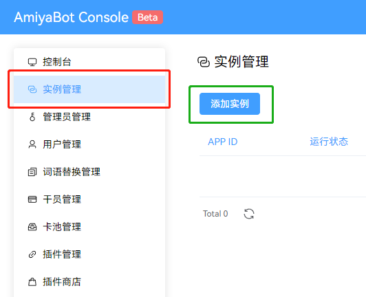
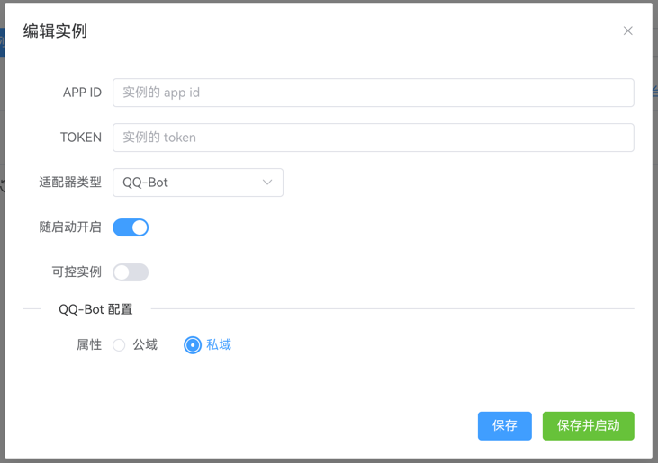
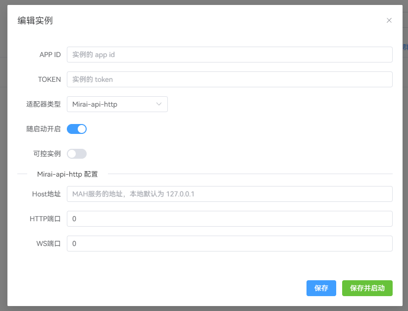
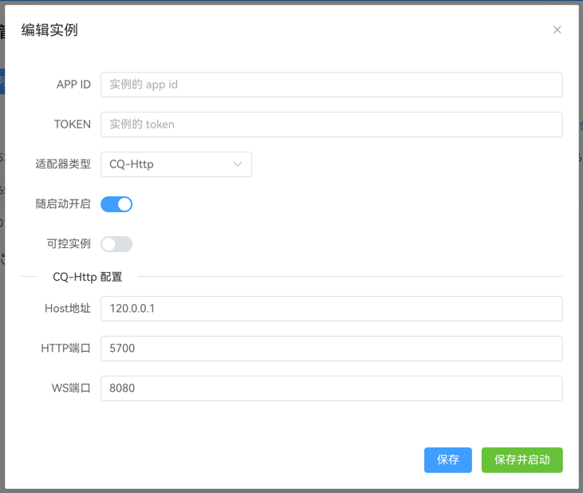

# 配置实例

“实例”指的是机器人的账号，兔兔支持登录多个机器人账号同时使用，多个账号之间共享数据。

## 添加实例

在左侧导航选择“实例管理”，并点击“添加实例”



## 填写配置表

### 腾讯频道机器人

填写你注册的频道机器人信息

::: details 窗口图示

:::

### mirai-api-http支持的群聊机器人

`APP ID` 为登录在 mirai-api-http 的 **QQ 号**。<br>
`TOKEN` 为 mirai-api-http 的 **AuthKey**。<br>
`Mirai-api-http 配置` 请准确填写你部署 mah 时的信息。

AuthKey 可在 mirai-console 目录下的文件 `config/net.mamoe.mirai-api-http/setting.yml` 找到

```yaml {6}
adapters:
  - http
  - ws
debug: false
enableVerify: true
verifyKey: ******* # 此处即是 AuthKey
singleMode: false
cacheSize: 4096
adapterSettings:
  http:
    host: 0.0.0.0
    port: 8080
    cors: [ * ]
  ws:
    host: 0.0.0.0
    port: 8060
    reservedSyncId: -1
```

::: details 窗口图示

:::

### go-cqhttp支持的群聊机器人

`APP ID` 为登录在 go-cqhttp 的 **QQ 号**。<br>
`TOKEN` 不需要填。<br>
`CQ-Http 配置` 请准确填写你部署 go-cqhttp 时的信息。

::: details 窗口图示

:::

### 点击“保存并启动”运行实例。

当实例状态为在线时，即启动成功。


## 配置可控实例

配置时打开选项 `可控实例`，并填写一个群号。可接收到该实例的一些相关通知。


