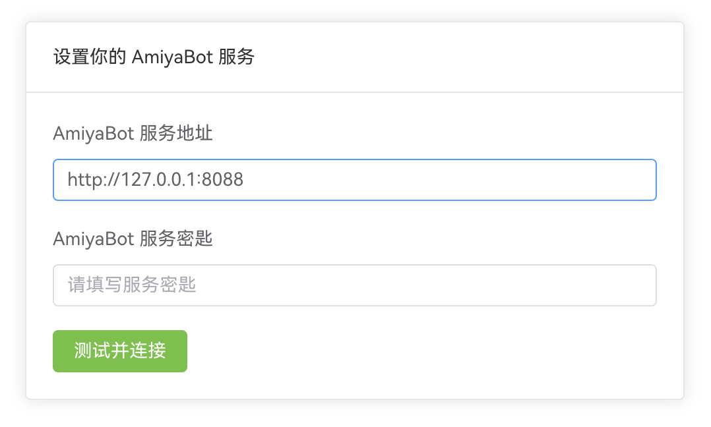

# 连接控制台

兔兔在启动后会开启一个 HTTP 服务，默认端口为 8088。提供给 [控制台](https://console.amiyabot.com)
调用。你可以根据需要在启动前修改配置`config/server.yaml`。

```yaml
host: 127.0.0.1
port: 8088
authKey:
```

authKey 为连接控制台时的密钥，默认不需要。

::: danger **危险**<br>
**当您试图将控制台暴露至公网时，请务必设定 authKey！** <br>
**如果不这么做，您的服务将可能面临极大的安全风险！因此造成的一切后果与项目组无关，由您自行承担！**
:::

::: warning **注意**<br>
**不推荐您使用纯数字，或是简单的数字、字母组合等弱口令作为 authKey（如 `123456`, `000000`, `abcdef` 等）。** <br>
**如果您坚持这么做，您的服务将可能面临较大的安全风险！因此造成的一切后果与项目组无关，由您自行承担！** <br>
**特别的，当您尝试使用纯数字的 authKey 时，由于 YAML 规范定义其为整数类型，您的 authKey 将可能因类型错误无法识别。如果您坚持使用纯数字的 authKey，请使用单引号 `''` 或双引号 `""` 将 authKey 括起。**
:::

## 连接

浏览器打开控制台 http://ns.console.amiyabot.com，在主界面填入你的服务地址。<br>
默认为 http://127.0.0.1:8088

> `ns.console.amiyabot.com` 是使用不安全的 HTTP 协议的控制台。若您的服务器位于公网且对外暴露了控制台端口，我们强烈推荐您使用 HTTPS 安全连接 https://console.amiyabot.com
> 此时您需要为您的服务配置https证书以加密传输，若您使用自签名证书，可以前往浏览器设置项开启允许不安全内容以连接服务器

::: danger **危险**<br>
**任何因您服务使用 HTTP 非安全连接引起的控制台秘钥泄露所导致的一切后果与项目组无关，由您自行承担！** <br>
:::



点击“测试并连接”，成功进入后即可开始配置。

## 公网/局域网访问

host 配置为 `0.0.0.0` 即可让服务通过本机 IP 访问

```yaml
host: 0.0.0.0
```

::: danger **危险**<br>
**当您试图从公网连接至控制台时，请务必通过反向代理加密连接！** <br>
**如果不这么做，您的服务将面临极大的安全风险！因此造成的一切后果与项目组无关，由您自行承担！**
:::

我们的团队成员 Initial-heart
为你提供了 [一篇通过 Nginx 反向代理加密连接的博客](https://www.initbili.top/2022/84452dac2fe6/)，你可以根据这篇博客对你的连接进行加密。
