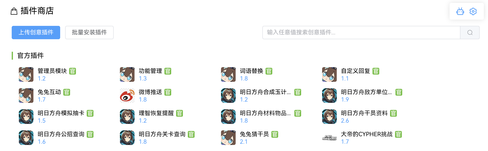

# 安装插件

选择安装你需要的功能插件

## 在插件商店安装插件

::: tip 温馨提示 
插件商店陈列的插件均为官方维护或是第三方但通过官方审核的。
:::

插件商店可以实时查看有新版本的插件，需要时可通过商店更新。

## 通过插件包自动安装

插件通常是一个zip压缩包或是 Python Package 的形式，你可以将它放在 plugins 目录下，启动时可以自动安装。

## 管理插件

安装好的插件可以在**插件管理**查看，现在，你已经可以使用它们了。

点击插件文档可以查看功能的使用方法。

<h3 style="color: #f44336">🎉 恭喜你，到这里你已经部署完成了！快去体验兔兔吧！🎉</h3>

之后的文档，将会详细讲解日常使用上的一些操作方法。敬请期待！
