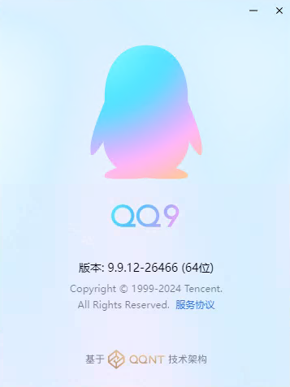
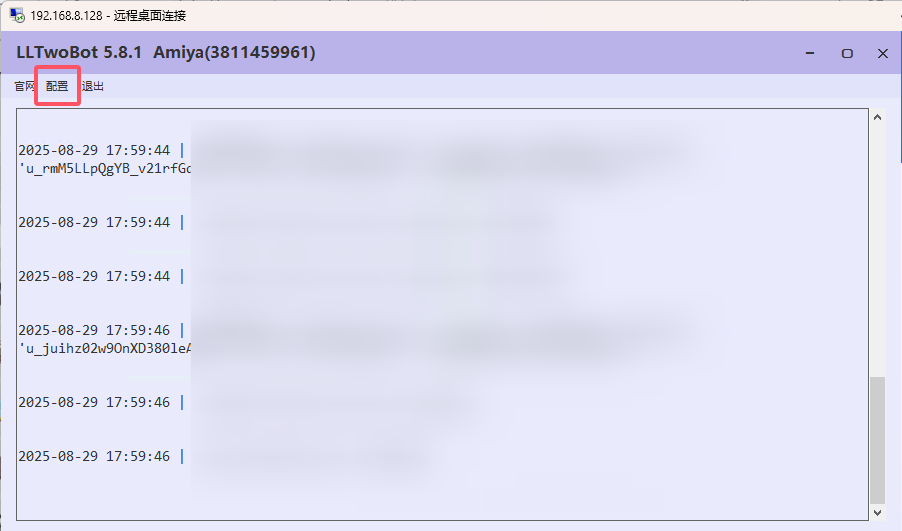

# LLOneBot QQ群机器人

**LLOneBot 支持最新版本的 QQ。注意要用原版的 QQ ，不要安装任何插件！**
如果以前装过 LLOneBot5.0 以下版本，请卸载 QQ 并删干净 QQ 安装目录！

首先你需要下载并安装 [NTQQ](https://im.qq.com/pcqq/index.shtml)。注意，不是普通的 Windows QQ，而是 **NTQQ**。
安装后，打开 QQ 的菜单并点击关于，在底部看到 `基于QQNT技术架构` 证明你安装对了。

接下来，跟随 [llonebot的教程](https://llonebot.com/guide/getting-started)，安装 LLOneBot。

全部安装完成后，通过浏览器访问 `http://localhost:3080` 或点击 LLTwoBot 串口左上角的 `配置` 。

可以正常访问 LLTwoBot WebUI 就证明你安装成功了（首次访问WebUI时会要求设置密码）。

## 配置

### 使用 WebUI 配置

按照下图所示（看不清楚可以右键图片在新标签中打开），填写 LLOneBot 配置项，和配置 AmiayBot 实例。其中新消息上报格式要选择消息段。

1. AppID：填写机器人 QQ 号。
2. Token：与 WebUI 中的 OneBot 11 Token 填写一致即可（可以均为空）。
3. 适配器：选择 OneBot 11 机器人并在 WebUI 中启用 OneBot 11 协议。
4. Host 地址：若 AmiyaBot 与 LLOneBot 在同一设备上，则填写 127.0.0.1，否则根据实际情况填写 LLOneBot 所在设备 IP 并确认目标设备防火墙放行。
5. HTTP 端口：在 WebUI 中启用 HTTP 服务并与 WebUI 中填写的 HTTP 端口一致（若与 AmiyaBot 不在同一设备请确认目标设备防火墙放行端口）。
6. WS 端口：在 WebUI 中启用正向 WS 服务并与 WebUI 中填写的正向 WS 端口一致（若与 AmiyaBot 不在同一设备请确认目标设备防火墙放行端口）。
7. **记得保存！记得保存！记得保存！**

### 使用 LLOneBot 配置文件 配置

可参考 [LLOneBot 配置文件](https://llonebot.com/guide/getting-started#llonebot-%E9%85%8D%E7%BD%AE%E6%96%87%E4%BB%B6)
略。
