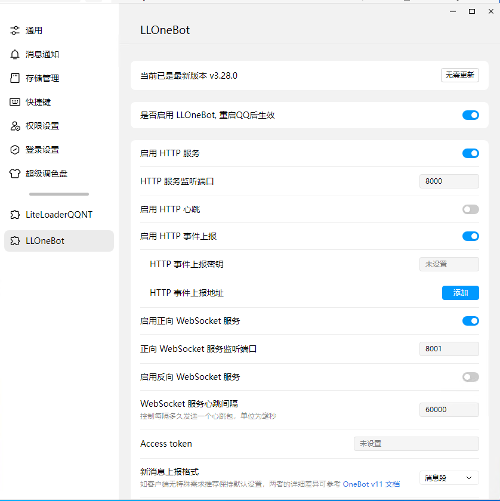

# LLOneBot QQ群机器人

当前环境下，推荐使用 LLOneBot 部署QQ机器人。 
首先你需要下载并安装 [NTQQ](https://im.qq.com/pcqq/index.shtml)。注意，不是普通的 Window QQ，而是 **NTQQ**。
安装后，打开 QQ 的菜单并点击关于，在底部看到 `基于QQNT技术架构` 证明你安装对了。

接下来，跟随 [llonebot的教程](https://llonebot.github.io/zh-CN/guide/getting-started)，安装 LiteLoaderQQNT 和 LLOneBot。

全部安装完成后，打开 QQ 的设置菜单，可以看到 LLOneBot 就证明你安装成功了。

接下来，按照下图所示（看不清楚可以右键图片在新标签中打开），填写 LLOneBot 配置项，和配置 AmiayBot 实例。 
其中新消息上报格式要选择消息段。

